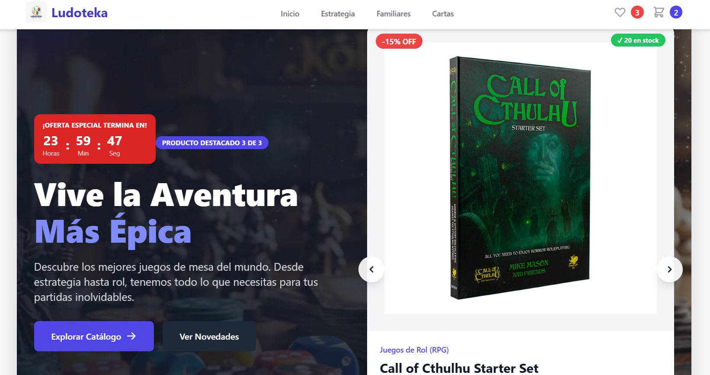
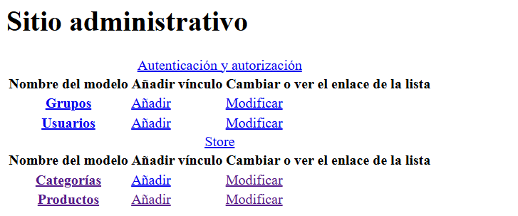
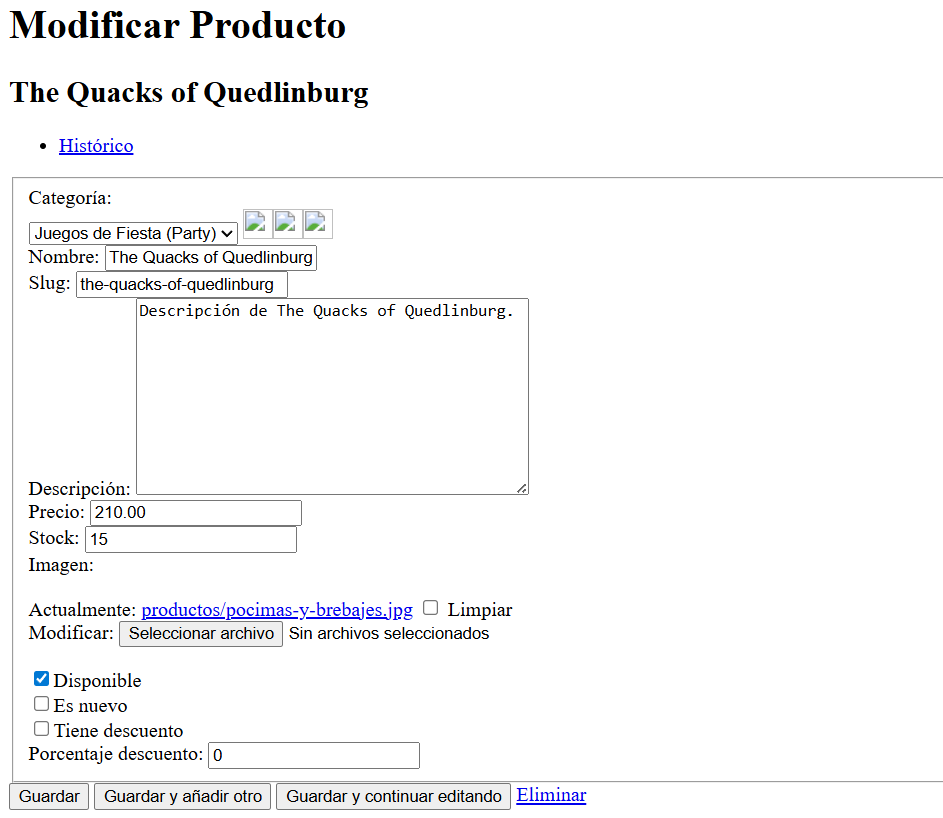

# 📦 LUDOTEKA

### Desarrollo de Aplicaciones Empresariales

**Autor:** Carlos Alberto Llano Flores  
**Fecha:** 19-11-2025


---

## 🚀 Descripción del Proyecto

**LUDOTEKA** es un sistema ecommerce completo desarrollado como parte del curso **Desarrollo de Aplicaciones Empresariales**. Combina tecnologías modernas para crear una experiencia de comercio electrónico robusta y escalable.

### Componentes principales:
- **Backend:** Django REST Framework para APIs potentes y seguras
- **Frontend:** React con JavaScript para interfaces dinámicas
- **Gestión completa:** Productos, categorías e inventario en tiempo real
- **Sistema multimedia:** Subida y gestión de imágenes (`media/`)
- **Panel administrativo:** Django Admin personalizado
- **API REST:** Arquitectura modular y extensible

---

## 🛒 Rubro del Proyecto

### 🧩 Tienda de Juegos de Mesa y Accesorios

Especializada en la venta de:
- 🎲 Juegos de estrategia
- 👨‍👩‍👧‍👦 Juegos familiares
- 🃏 Juegos de cartas
- 🎨 Accesorios para gaming
- 📦 Expansiones y contenido adicional

---

## 🧱 Arquitectura del Sistema
```
MI-ECOMMERCE-PRO/
│
├── backend/
│   ├── manage.py
│   ├── db.sqlite3
│   ├── media/              # Imágenes subidas
│   └── store/
│       ├── models.py       # Modelos de datos
│       ├── views.py        # Lógica de negocio
│       ├── urls.py         # Rutas API
│       ├── admin.py        # Configuración admin
│       └── serializers.py  # Serialización JSON
│
├── frontend/
│   ├── src/                # Código fuente React
│   ├── public/             # Recursos estáticos
│   └── package.json        # Dependencias
│
├── imgs/                   # Assets del frontend
└── README.md
```

---

## 🖥️ Tecnologías Utilizadas

| Componente | Tecnología |
|-----------|------------|
| **Backend** | Django 5 + Django REST Framework |
| **Frontend** | React + Vite |
| **Base de datos** | SQLite (desarrollo) |
| **Servidor** | VPS Linux + Nginx |
| **API** | JSON REST API |
| **Autenticación** | Django Admin + JWT |

---

## ⚙️ Características Implementadas

### ✅ Backend

- ✔️ CRUD completo de productos
- ✔️ CRUD de categorías
- ✔️ Sistema de inventario dinámico
- ✔️ Endpoints REST documentados
- ✔️ Manejo de imágenes con `MEDIA_ROOT`
- ✔️ Validaciones de datos robustas

### ✅ Frontend

- ✔️ Catálogo de productos responsive
- ✔️ Vista detallada de productos
- ✔️ Navegación por categorías
- ✔️ Interfaz personalizada (branding completo)
- ✔️ Optimización de carga de imágenes

### ✅ Panel de Administración

- ✔️ Registro y edición de productos
- ✔️ Upload múltiple de imágenes
- ✔️ Gestión de categorías jerárquicas
- ✔️ Control de inventario en tiempo real
- ✔️ Dashboard de estadísticas

---

## 📸 Capturas del Sistema

### 🏪 Vista principal de la tienda



*Navegación fluida por el catálogo de productos*

---

### 🎛️ Panel de administración



*Gestión intuitiva desde el dashboard de Django*

---

### 🗃️ Gestión de productos



*CRUD completo con validación en tiempo real*

---

## 🔧 Instalación y Configuración

### 📦 Backend (Django)
```bash
# Navegar al directorio backend
cd backend

# Crear entorno virtual
python -m venv venv

# Activar entorno virtual
source venv/bin/activate   # Linux/Mac
venv\Scripts\activate      # Windows

# Instalar dependencias
pip install -r requirements.txt

# Realizar migraciones
python manage.py migrate

# Crear superusuario (opcional)
python manage.py createsuperuser

# Iniciar servidor de desarrollo
python manage.py runserver
```

El backend estará disponible en: `http://localhost:8000`

---

### 💻 Frontend (React)
```bash
# Navegar al directorio frontend
cd frontend

# Instalar dependencias
npm install

# Iniciar servidor de desarrollo
npm run dev
```

El frontend estará disponible en: `http://localhost:5173`

---

## 🛠️ Configuración de Imágenes

### En `settings.py`:
```python
# Configuración de archivos multimedia
MEDIA_URL = '/media/'
MEDIA_ROOT = BASE_DIR / 'media'
```

### En `urls.py` (principal):
```python
from django.conf import settings
from django.conf.urls.static import static

urlpatterns = [
    # ... tus urls aquí
]

# Servir archivos media en desarrollo
if settings.DEBUG:
    urlpatterns += static(settings.MEDIA_URL, document_root=settings.MEDIA_ROOT)
```

---

## 📤 Despliegue en VPS

### Pasos para producción:

1. **Preparar el servidor**
```bash
   sudo apt update && sudo apt upgrade -y
   sudo apt install python3-pip python3-venv nginx
```

2. **Subir proyecto al servidor**
```bash
   git clone 
   cd MI-ECOMMERCE-PRO
```

3. **Configurar backend**
```bash
   python3 -m venv venv
   source venv/bin/activate
   pip install -r backend/requirements.txt
   pip install gunicorn
```

4. **Configurar Gunicorn**
```bash
   gunicorn --bind 0.0.0.0:8000 backend.wsgi:application
```

5. **Configurar Nginx**
```nginx
   server {
       listen 80;
       server_name tu-dominio.com;

       location /media/ {
           alias /ruta/a/media/;
       }

       location / {
           proxy_pass http://127.0.0.1:8000;
       }
   }
```

6. **Permisos para media/**
```bash
   sudo chown -R www-data:www-data media/
   sudo chmod -R 755 media/
```

7. **Build del frontend**
```bash
   cd frontend
   npm run build
```

---

## 🤝 Contribución

Las contribuciones son bienvenidas. Para colaborar:

1. Fork del proyecto
2. Crea una rama para tu feature (`git checkout -b feature/AmazingFeature`)
3. Commit de tus cambios (`git commit -m 'Add some AmazingFeature'`)
4. Push a la rama (`git push origin feature/AmazingFeature`)
5. Abre un Pull Request

---

## 📝 Roadmap

- [ ] Sistema de carrito de compras
- [ ] Integración con pasarelas de pago
- [ ] Sistema de reviews y valoraciones
- [ ] Notificaciones por email
- [ ] Dashboard de analytics
- [ ] App móvil con React Native

---

## 📄 Licencia

Este proyecto está bajo la Licencia MIT. Consulta el archivo `LICENSE` para más detalles.

---

## 👤 Autor

**Carlos Alberto Llano Flores**

- GitHub: [@Kreissys](https://github.com/Kreissys)
- Email: car.alberto549@gmail.com

---

## 🙏 Agradecimientos

Proyecto desarrollado para el curso de **Desarrollo de Aplicaciones Empresariales**.

---

⭐ **¡Si te gusta este proyecto, dale una estrella!** ⭐
